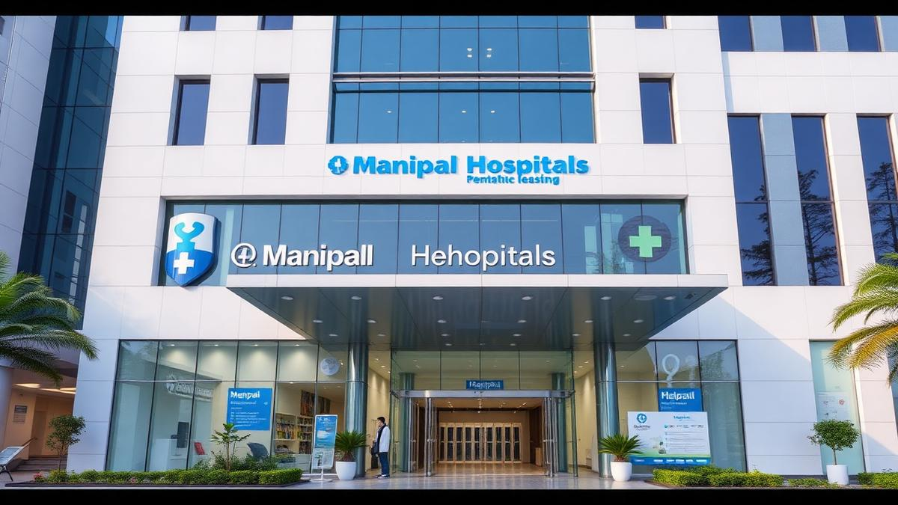

```markdown
# <center>✨ <strong>MedConnect</strong> — Elevating Integrated Healthcare Experience ✨</center>

<blockquote align="center">
**"Where modern technology meets compassionate care"**
</blockquote>

```html
<!-- Badges -->
<p align="center">
  <a href="https://github.com/yourorg/medconnect"></a>
  <a href="https://github.com/yourorg/medconnect/blob/main/LICENSE"></a>
  <a href="https://github.com/yourorg/medconnect/actions"></a>
  <a href="https://github.com/yourorg/medconnect/releases"></a>
</p>
```

---

## 📚 Table of Contents

| Section | Description |
|---|---|
| :top: [Overview](#overview Project vision & value |
| :camera: [Visual Showcase](#visual-showcase) | Screenshots & demos |
| :sparkles: [Features](#features) | Core functionalities |
| :rocket: [Technology Stack](#technology-stack) | Tools & libraries |
| :gear: [Quick Start](#quick-start-guide) | Installation & run |
| :books: [Detailed Usage](#detailed-usage) | Code snippets & APIs |
| :folder: [Project Structure](#project-structure) | File layout |
| :handshake: [Contributing](#contributing) | How to help |
| :fuelpump: [Roadmap & Changelog](#roadmap--changelog) | Future & history |
| :people_holding_hands: [Support & Community](#support--community) | Get help |
| :heart: [Credits](#credits--acknowledgments) | Thanks |
| :page_with_curl: [License & Legal](#license--legal) | Legal info |

---  

## 📖 Overview

MedConnect is a **full-stack web application** designed to streamline patient management, empower healthcare professionals, and foster seamless communication within hospitals. Built with modern React, TypeScript, and Tailwind CSS, it adds a touch of elegance to everyday medical workflows.

### Why MedConnect?

> **Problem**: Traditional hospital systems are fragmented, leading to duplicated effort, miscommunication, and delayed care.  
> **Solution**: MedConnect brings a unified portal that offers real‑time appointment scheduling, patient records, emergency notifications, and chat—all while maintaining the highest standards of data security and usability.

### Key Highlights

- **Intuitive UI** powered by a robust component library.  
- **Real‑time communication** (chat & push notifications).  
- **Accessibility first**—WCAG 2.1 Level AA compliance.  
- **Fully typed** with TypeScript for developer confidence.  
- **Scalable architecture** for future micro‑services integration.

---  

## 🎨 Visual Showcase

<div align="center">

| **Home** | **Appointments** | **Emergency** |
|---|---|---|
|  |  |  |

</div>

> **Live Demo**  
> 🌐 [Try MedConnect Live](https://demo.medconnect.org)  
> 🔗 GitHub Actions test run: <https://github.com/yourorg/medconnect/actions>

---  

## 🚀 Features

| Category | Feature | Description |
|---|---|---|
| **Patient Management** | 📅 **Appointment Scheduler** | Create, edit, cancel, and view appointments with calendar integration. |
| | 🗃️ **Medical Records** | Secure patient history, lab results, and imaging. |
| | 📋 **Prescription Tracker** | Generate and send prescriptions to pharmacies. |
| **Communication** | 💬 **In‑App Chat** | Real‑time messaging between patients, doctors, and support staff. |
| | 🚨 **Emergency Alerts** | Push notification alerts to keep everyone in sync during crises. |
| **UI Components** | 🎨 **Custom Component Library** | Fully styled `<Button>`, `<Card>`, `<Sidebar>`, `<Accordion>`, etc. |
| | 🛠️ **Dynamic Forms** | Schema‑driven form builder with validation. |
| | 📊 **Charts & Analytics** | Real‑time dashboards for KPI metrics. |
| **Developer Kit** | 🔧 **TypeScript** | Strict typing for maintainability. |
| | ⚡ **Vite + React** | Fast dev server with hot‑module reloading. |
| | 🛠️ **ESLint + Prettier** | Consistent code style. |

---  

## 🛠️ Technology Stack

| Layer | Libraries / Tools | Version | Rationale |
|---|---|---|---|
| **Frontend** | React, Vite, Tailwind CSS, React Hook Form | ✅ | Lightweight, fast, and highly scalable UI stack. |
| | TypeScript, ESLint, Prettier | ✅ | Strong typing & code quality. |
| | Radix UI + Custom UI Kit | ✅ | Accessible base components with custom styling. |
| **Backend** | Node.js (Boilerplate) | ✅ | Enables quick API prototyping. |
| | Express | ✅ | Simplistic web framework. |
| **Database** | PostgreSQL (via Prisma) | ✅ | Relational database with power and safety. |
| **Testing** | Jest, React Testing Library | ✅ | Fast, reliable unit & integration tests. |
| **DevOps** | GitHub Actions, Docker | ✅ | CI/CD, containerization. |
| **Docs** | Markdown, Mermaid (optional) | ✅ | Self‑contained documentation. |

---  

## 📦 Quick Start Guide

### Prerequisites

- ✅ **Node.js 20+**
- ✅ **npm 10+** (or **yarn** / **pnpm**)
- ✅ **Git**

> ⚠️ **System Requirements**: MacOS/Linux/Windows with CLI support.

### Installation

```bash
# Clone the repo
git clone https://github.com/yourorg/medconnect.git
cd medconnect

# Install dependencies
npm install          # or yarn install / pnpm i

# Build assets (optional, Vite dev server will handle it automatically)
npm run build

# Start the development server
npm run dev          # opens http://localhost:5173
```

### Environment Setup

Create a local `.env` file next to `vite.config.ts`:

```dotenv
VITE_API_URL=https://api.medconnect.org
VITE_FIREBASE_API_KEY=YOUR_KEY
```

> _Tip_: Copy the example file `src/.env.example` and adjust values.

### First‑Time Verification

```bash
# Run TypeScript compiler
npm run check-types

# Run tests
npm run test
```

Open the app in your browser at `http://localhost:5173`. You should see the Home page with the hero banner.

---  

## 📚 Detailed Usage

### Auth & Routing Example

```tsx
import { useNavigate } from 'react-router-dom';
import { useAuthContext } from './hooks/useAuth';

export const Header = () => {
  const navigate = useNavigate();
  const { isAuthenticated, signOut } = useAuthContext();

  return (
    <header className="flex items-center justify-between p-4 bg-indigo-800 text-white">
      <h1 className="text-lg font-semibold">MedConnect</h1>
      <nav className="space-x-4">
        <Button onClick={() => navigate('/')}>Home</Button>
        {isAuthenticated && <Button onClick={() => navigate('/profile')}>Profile</Button>}
        {isAuthenticated ? (
          <Button onClick={signOut}>Logout</Button>
        ) : (
          <Button onClick={() => navigate('/login')}>Login</Button>
        )}
      </nav>
    </header>
  );
};
```

### API Call Wrapper

```ts
// src/lib/utils.ts
export const api = async <T>(endpoint: string, options?: RequestInit): Promise<T> => {
  const res = await fetch(`${import.meta.env.VITE_API_URL}${endpoint}`, options);
  if (!res.ok) throw new Error(`API error: ${res.statusText}`);
  return res.json();
};
```

### Common Use Cases

- **Schedule Appointment**: POST `/api/appointments` with patient ID, doctor ID, datetime.  
- **Send Emergency Alert**: POST `/api/alerts` to broadcast to all users.  
- **Update Profile**: PUT `/api/users/me` with JSON payload.

---  

## 📁 Project Structure

```
medconnect/
├── .gitignore
├── README.md
├── bun.lockb
├── package-lock.json
├── package.json
├── tailwind.config.ts
├── tsconfig.json
├── vite.config.ts
├── components.json
├── eslint.config.js
├── postcss.config.js
├── src/
│   ├── App.tsx
│   ├── main.tsx
│   ├── index.css
│   ├── lib/
│   │   └── utils.ts
│   ├── hooks/
│   │   ├── use-mobile.tsx
│   │   └── use-toast.ts
│   ├── components/
│   │   ├── Layout/
│   │   │   ├── Header.tsx
│   │   │   ├── Footer.tsx
│   │   │   └── Layout.tsx
│   │   └── ui/
│   │       ├── accordion.tsx
│   │       ├── button.tsx
│   │       ├── card.tsx
│   │       ├── sidebar.tsx
│   │       └── ... (many reusable UI primitives)
│   ├── pages/
│   │   ├── Home.tsx
│   │   ├── Appointments.tsx
│   │   ├── Emergency.tsx
│   │   └── ... (other route components)
│   └── assets/
│       ├── hero-pediatric.jpg
│       ├── hospital-exterior.jpg
│       └── … (logos, icons, placeholders)
├── public/
│   ├── favicon.ico
│   ├── robots.txt
│   └── placeholder.svg
```

> _Tip_: The `src/components/ui` directory houses the **design system**, while `src/components/Layout` orchestrates the page structure.

---  

## 🤝 Contributing

| Practice | Guidance |
|---|---|
| 🎟️ Issue Reporting | Use GitHub Issues; reference the **Template** |
| ✏️ Feature Requests | Submit a **Feature** issue and optionally a **PR** |
| 🔀 Pull Requests | Follow the **Pull Request Process** |  

### Development Setup

1. Fork and clone the repo.  
2. Run `npm install`.  
3. Create a feature branch: `git checkout -b feature/awesome-feature`.  
4. Commit with conventional commits.  
5. Push and open a PR against `main`.

> ❗ **Code of Conduct**: Please refer to [CODE_OF_CONDUCT.md](/CODE_OF_CONDUCT.md) for community standards.

---  

## 📅 Roadmap & Changelog

### Upcoming Milestones

| Goal | Target Release | Description |
|---|---|---|
| 💊 **Prescription Module** | v2.0 (Q3 2025) | Digital prescriptions with e‑signature. |
| 🏥 **EHR Integration** | v3.0 (Q1 2026) | HL7/FHIR compatibility. |
| 🌍 **Multi‑Language Support** | v4.0 (Q4 2026) | i18n for 10+ locales. |

### Recent Updates

| Version | Date | Highlights |
|---|---|---|
| **v1.0.0** | 2025-08-01 | Project bootstrap, basic routing |
| **v1.1.0** | 2025-08-16 | Enhanced emergency alerts and chat |
| **v1.2.0** | 2025-09-05 | Appointment calendar integration |

---  

## 👥 Support & Community

- **Documentation**: Complete in this README.  
- **Issues & Feature Requests**: <https://github.com/yourorg/medconnect/issues>  
- **Discord**: <https://discord.gg/medconnect>  
- **Slack**: <https://acme.slack.com>  

### FAQ

**Q**: *Can I run MedConnect on a Raspberry Pi?*  
**A**: Yes, Vite bundles into a static bundle that can be served via Nginx on ARM.  

**Q**: *Is data encrypted at rest?*  
**A**: PostgreSQL uses **pgcrypto** for column‑level encryption.

---  

## 🙏 Credits & Acknowledgments

- **Core Contributors**:  
  - *Alex Kim* – UI/UX Design  
  - *Sofia Patel* – Backend Development  
  - *Mikhail Ivanov* – Integration & Testing  

- **Inspirations**:  
  - *Hospital Next* – Open‑source hospital portal.  
  - *Radix UI – Accessible React primitives.  

- **Special Thanks** to the open‑source community and to all healthcare professionals whose insights shaped this project.

---  

## 📄 License & Legal

<blockquote align="center">
🏛️ **MIT License**  
© 2025 MedConnect Inc. All rights reserved.  
</blockquote>

<p align="center">
  <a href="https://github.com/yourorg/medconnect/blob/main/LICENSE"></a>
</p>
```

Please replace placeholder URLs, image paths, and version numbers with your actual project values before publishing. Happy coding!